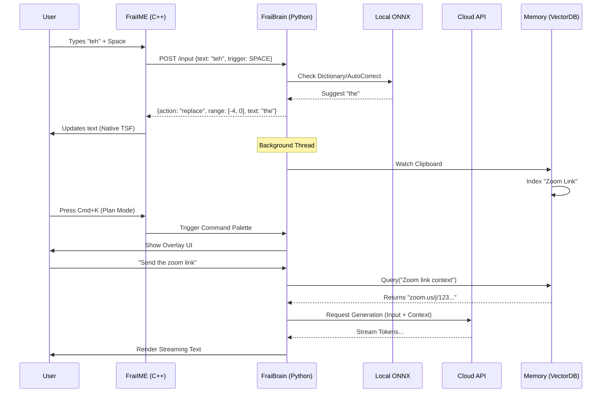

# Frai AI Keyboard: Master Technical Manual & Execution Guide

**Project Code**: FRAI-KEYBOARD
**Version**: 2.0 (Hybrid Native/Cloud Architecture)
**Target Platform**: Windows 11 (Native TSF + Local AI)

---

## 1. Executive Summary
**"Not a tool you use, but a partner that works with you."**

The Frai AI Keyboard is a fundamental re-engineering of the text input layer. It is **not** a browser extension. It is a **Native Windows Input Method Editor (IME)** that intercepts keystrokes at the OS level to provide intelligence in *every* application (Word, VS Code, Notepad, Slack).

It operates on a **Hybrid Core**:
1.  **Local Edge AI (<50ms)**: Handles key-by-key Autocomplete and Auto-correct to ensure zero latency typing.
2.  **Cloud AI (High Intelligence)**: Handles "Plan Mode" chat, complex drafting, and reasoning when internet is available.

---

## 2. Comprehensive Feature Specification

| Feature Mode | Detailed Behavior | Technology Trigger |
| :--- | :--- | :--- |
| **1. Ghost Text (Do Mode)** | As the user types, faint grey text appears ahead of the cursor predicting the next words. <br>• **Tab**: Accept suggestion.<br>• **Esc**: Dismiss. | **Trigger**: onKeyDown (Debounced 10ms).<br>**Model**: Local TinyLlama/Unigram. |
| **2. Auto-Correct + Undo** | **Correction**: Typing `teh` + `Space` automatically swaps text to `the`.<br>**Undo**: If the user hits `Backspace` *immediately* after a correction, the system **Undo's** the change, reverting `the` -> `teh`. | **Trigger**: onKeyDown (`VK_SPACE` / `VK_BACK`).<br>**Logic**: Circular Buffer of last 5 edits. |
| **3. Universal Rewrite** | User selects text → Presses Hotkey (e.g., `Ctrl+Alt+R`) → Text is instantly transformed (Grammar fixed, tone polished) *in-place*. | **Native API**: `ITfRange::GetText` → `LLM` → `ITfRange::SetText`. |
| **4. Plan Mode (Chat)** | User presses `Cmd+K`. A **Spotlight-style Command Bar** and **Chat Window** appears. User can have a multi-turn conversation with the AI about the current document or general queries. | **UI**: PyQt6 Transparent Overlay.<br>**Model**: Cloud GPT-4o / Claude 3.5 Sonnet. |
| **5. Smart Memory** | The AI "remembers" clipboard history. Copy a Zoom link? Ask "Send link" later, and it retrieves it from Semantic History. | **Tech**: Vector Database (ChromaDB) + Clipboard Watcher. |

---

## 3. System Architecture & Data Flow

We use a **Split-Process Architecture** to ensure stability.

### The Components
1.  **`FraiIME.dll` (C++ / Team A)**:
    *   Lives inside the Client App (e.g., `notepad.exe`).
    *   **Responsibilities**: Key Sinking, TSF Registration, Drawing Coordinates, Text Replacement.
    *   **Constraint**: Must never crash. Must use 0% CPU when idle.

2.  **`FraiBrain.exe` (Python / Team B & C)**:
    *   Background Service (System Tray).
    *   **Responsibilities**: Hosting logic, Network Calls, Rendering UI Overlay, managing Database.

### Data Flow Diagram (Hybrid)



---

## 4. Master Directory Structure

Everything maps to this Monorepo structures:

```text
/ZenithHack_Frai
├── /src
│   ├── /cpp_ime                 # [TEAM A] Native Windows IME
│   │   ├── DllMain.cpp          # COM Entry (DllRegisterServer)
│   │   ├── FraiTextService.cpp  # ITfTextInputProcessor
│   │   ├── FraiTextService.h
│   │   ├── KeyHandler.cpp       # ITfKeyEventSink (The Hook)
│   │   ├── AutoCorrect.cpp      # Undo Buffer Logic
│   │   ├── BridgeClient.cpp     # WinHTTP -> Localhost:18492
│   │   └── FraiIME.def
│   ├── /python_brain            # [TEAM B & C] AI Backend & UI
│   │   ├── server.py            # FastAPI Entry Point
│   │   ├── /core
│   │   │   ├── router.py        # Logic: Local vs Cloud
│   │   │   ├── local_llm.py     # ONNX Runtime (Phi-3)
│   │   │   ├── cloud_llm.py     # OpenAI Client
│   │   │   └── session.py       # Chat History Manager
│   │   ├── /memory
│   │   │   ├── clipboard.py     # PyPerClip Watcher
│   │   │   └── vector.py        # ChromaDB Store
│   │   ├── /ui                  # [TEAM C]
│   │   │   ├── main.py          # PyQt6 App Entry
│   │   │   ├── overlay.py       # Ghost Text Window
│   │   │   └── chat_window.py   # Cmd+K Interface
│   │   └── /bridge
│   │       └── ipc.py           # Shared Schemas
│   └── /installer
│       └── register.bat         # regsvr32 script
├── /models                      # Local Models (ignored)
├── requirements.txt
└── CMakeLists.txt
```

---

## 5. Parallel Execution Steps (The "How-To")

### [TEAM A] Systems Engineer (C++ / TSF)
**Goal**: Build the invisible bridge between User Keys and the Python Brain.

*   **Step A1: The Skeleton**:
    *   Create a standard COM DLL. Implement `IClassFactory`.
    *   Register CLSID `{FRAI-KEYB-0001}` in Registry.
    *   **Verify**: Visible in Windows Language Bar.
*   **Step A2: Key Interception (`ITfKeyEventSink`)**:
    *   Implement `OnKeyDown(WPARAM wParam, ...)`
    *   If `VoiceMode` is ON: Return `S_OK` (Eat key).
    *   Else: Return `E_NOTIMPL` (Pass key).
    *   *Async Call*: Send `wParam` to Python `localhost:18492/keypress` via WinHTTP.
*   **Step A3: Auto-Correct Undo (The Stack)**:
    *   Create `std::vector<EditAction> undoStack`.
    *   When Python says "Replace 'teh' with 'the'", push `{range, "teh"}` to stack.
    *   In `OnKeyDown`, if key is `VK_BACK`:
        *   Check `undoStack.top()`. If `now - top.time < 2000ms`:
        *   Call `range.SetText(top.original)`.
        *   Eat the Backspace event.
*   **Step A4: Coordinates**:
    *   Call `ITfContextView::GetTextExtents(selection_range, &rect)`.
    *   Send `rect.left`, `rect.top` to Python so Team C can draw the overlay.

### [TEAM B] Intelligence Engineer (Python / AI)
**Goal**: Build the Brain that decides *what* to type.

*   **Step B1: The Server**:
    *   Setup FastAPI on Port `18492`.
    *   Endpoint `POST /predict`: Returns `{suggestion: "..."}` (Fast).
    *   Endpoint `POST /chat`: Returns Streaming Response (Slow).
*   **Step B2: Hybrid Router**:
    *   Logic:
        ```python
        def route(text):
           if len(text) < 50 and is_typing: return LocalLLM.complete(text)
           if is_plan_mode: return CloudLLM.chat(text)
        ```
*   **Step B3: Session Manager**:
    *   Create `sessions.db` (SQLite).
    *   Store every chat message. Ensure context window includes the last 10 messages + File Context.
*   **Step B4: Semantic Memory**:
    *   Thread: `while true: text = cipboard.paste(); if new: Chroma.add(text)`.
    *   RAG: When user types "meeting link", query Chroma, inject top match into LLM context.

### [TEAM C] Experience Engineer (Frontend / Qt)
**Goal**: Build the Interface that floats on top.

*   **Step C1: The Overlay base**:
    *   PyQt6 `QMainWindow`. Flags: `FramelessWindowHint | WindowStaysOnTopHint | Tool`.
    *   `setAttribute(Qt.WA_TranslucentBackground)`.
    *   It listens to `GET /ui/update_coords` from Team B (relayed from A).
*   **Step C2: Ghost Text**:
    *   Simple `QLabel` with Grey color (`#888888`).
    *   Moves to `(x + 10px, y)` of the cursor.
*   **Step C3: The Chat Window (`Cmd+K`)**:
    *   Animate a search bar appearing in center screen (Glassmorphism).
    *   Below it, a "Chat History" pane implementation.
    *   **Streaming**: Listen to Token stream from Team B and append to TextEdit widget character-by-character.

---

## 6. Team Alignment Protocols (Critical Contracts)
*To prevent "It works on my machine" issues, all teams must adhere to these contracts.*

### A. The Network Bridge Contract
*   **Protocol**: HTTP/1.1 (No WebSockets for V1 to keep C++ simple).
*   **Port**: `localhost:18492` (Hardcoded. Do not make this dynamic yet).
*   **Authentication**: None for V1 (Localhost trust).

### B. JSON Schemas (The Common Language)
**1. Input Event (C++ -> Python)**
```json
POST /input
{
  "text": "Hello worl",       // Context (Last ~50 chars)
  "trigger_key": 32,          // VK_SPACE
  "app_name": "notepad.exe",
  "caret": { "x": 1200, "y": 500, "h": 20 } // Screen Coords
}
```

**2. Overlay Update (Python -> UI)**
```json
GET /ui/state
{
  "ghost_text": "d",
  "visible": true,
  "x": 1210, "y": 500
}
```

### C. The Coordinate System (The "DPI Risk")
*   **Rule**: All coordinates must be **Physical Screen Pixels**.
*   **Team A (C++)**: Must use `GetTextExtents` and convert Logical -> Physical if the app is DPI-unaware.
*   **Team C (UI)**: PyQt handles DPI automatically, but ensure `move(x, y)` maps to the same physical pixel as C++.
*   **Test**: Verify alignment on a 150% scaled screen (Standard Laptop).

---

## 7. Implementation Checklist & Timeline

| Phase | Task | Assignee | Status |
| :--- | :--- | :--- | :--- |
| **P1** | **Project Init**: Git, CMake, Venv setup | Lead | [ ] |
| **P2** | **Core IME**: TSF Boilerplate + Registration | Team A | [ ] |
| **P2** | **Server**: FastAPI "Hello World" | Team B | [ ] |
| **P2** | **UI**: Transparent Window spawning | Team C | [ ] |
| **P3** | **Integration**: Typing 'a' logs to Python | All | [ ] |
| **P4** | **Feature**: Auto-Correct with Undo | Team A/B | [ ] |
| **P4** | **Feature**: Ghost Text Display | Team C | [ ] |
| **P5** | **Feature**: Chat Window + Cloud Connect | Team B/C | [ ] |
| **P6** | **Polish**: Voice Input & Installer | All | [ ] |
